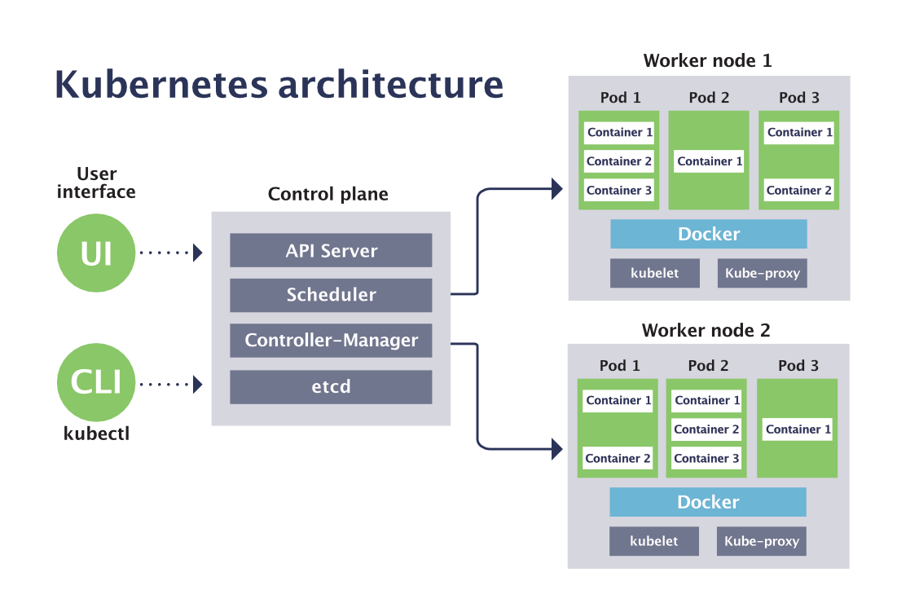

# Master Node Components

The master node contains several control plane components that manage the entire Kubernetes cluster. It keeps track of all nodes, decides where applications should run, and continuously monitors the cluster.

**ETCD Cluster:** Stores cluster-wide configuration and state data.

**Kube Scheduler:** Determines the best node for new container deployments.

**Controllers:** Manage node lifecycle, container replication, and system stability.

**Kube API Server:** Acts as the central hub for cluster communication and management.

# Worker Node Components

Worker nodes are responsible for running the containerized applications. Each node is managed by the Kubelet, which ensures that containers are running as instructed.

**Kubelet:** Manages container lifecycle on an individual node. It receives instructions from the Kube API server to create, update, or delete containers, and regularly reports the node's status.

**Kube Proxy:** Configures networking rules on worker nodes, thus enabling smooth inter-container communication across nodes. For instance, it allows a web server on one node to interact with a database on another.

| Component Category | Key Components                                   | Description                                                                 |
|-------------------|--------------------------------------------------|-----------------------------------------------------------------------------|
| Master Node       | etcd, Kube Scheduler, Controllers, Kube API Server | Centralized control and management of the entire cluster.                   |
| Worker Node       | Kubelet, Kube Proxy                              | Responsible for the lifecycle management of containers and service networking. |

**Note:**

The entire control system is containerized. Whether you are using Docker, Containerd, or CRI-O, every node (including master nodes with containerized components) requires a compatible container runtime engine.

