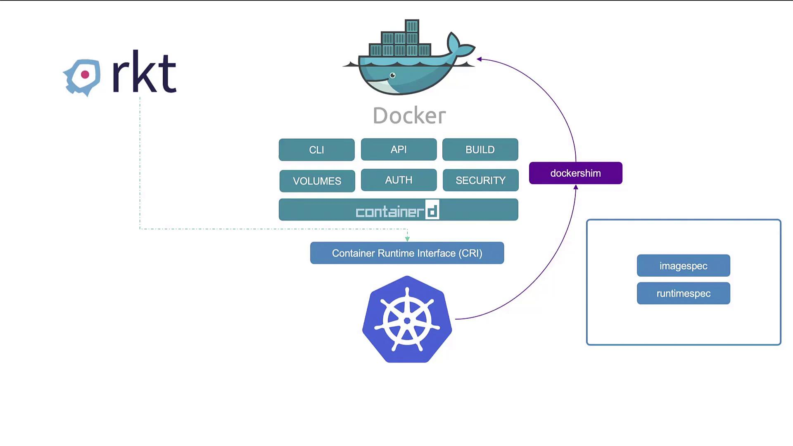
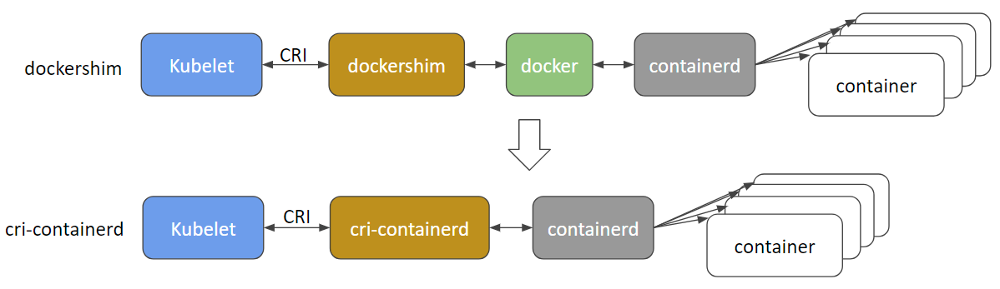
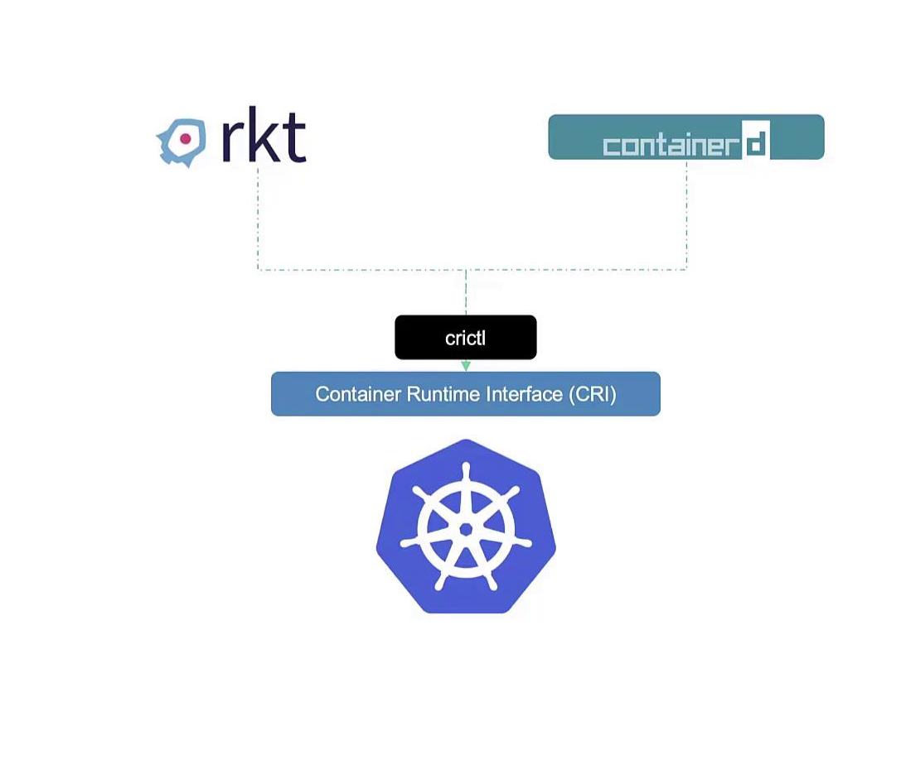
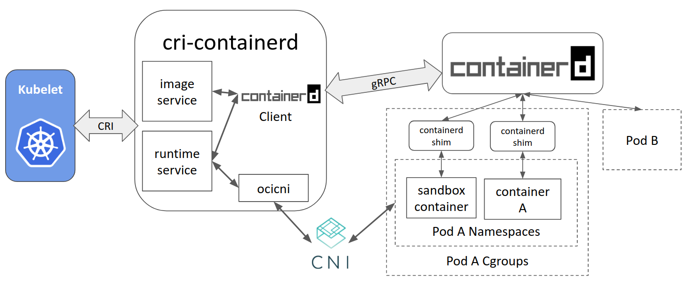

# Docekr vs ContainerD

## The Evolution of Container Runtimes

At the beginning of the container era, Docker quickly became the dominant platform due to its intuitive and user-friendly interface. Even though alternative tools like Rocket existed, Kubernetes was initially designed to orchestrate Docker-based containers, creating a strong coupling between Docker and Kubernetes. However, as *Kubernetes expanded its ecosystem, other container runtimes sought integration*.

Kubernetes addressed this need by introducing the **Container Runtime Interface (CRI)**. The CRI standardizes container runtimes by ensuring compliance with the **Open Container Initiative (OCI)** standards—the image specification (for building images) and the runtime specification (for container execution). This standardization paved the way for runtimes like Rocket and others to be supported by Kubernetes.

Since Docker was developed before CRI was established, it wasn’t built with CRI compatibility in mind. To allow Docker to function with Kubernetes, a temporary solution known as the **Docker Shim** was implemented. Over time, native CRI-compatible runtimes such as ContainerD emerged, shifting Docker’s primary role within the Kubernetes architecture.



ContainerD, a CRI-compatible runtime, integrates directly with Kubernetes—eliminating the need for the Docker Shim. Originally bundled with Docker, ContainerD has evolved into a standalone project under the Cloud Native Computing Foundation. This decoupling means you can install and use ContainerD without needing the entire Docker ecosystem if your goal is solely container runtime functionality.

The diagram below illustrates the relationship between Docker, Kubernetes, and alternative container runtimes (like rkt), highlighting components such as containerd, the Docker Shim, and the Container Runtime Interface (CRI).

Within Docker, several components work together to provide its functionality:

- Docker CLI and API
- Image build tools
- Support for volumes, authentication, and security
- The container runtime (runc) managed by containerd

Since ContainerD is CRI-compatible, it works directly with Kubernetes, which eventually led to Kubernetes version 1.24 removing support for Docker as a runtime due to the complexity of maintaining the Docker Shim. However, Docker images remain fully OCI-compliant and continue to work seamlessly with ContainerD.



## Diving Deeper into ContainerD

ContainerD began as an internal component of Docker but is now maintained as an independent project. If you do not require Docker's additional features, you can install ContainerD on its own. Traditionally, Docker users ran containers using commands like ```docker run```, but ContainerD introduces different CLI tools.

Once installed, `ctr` can pull images and execute basic container operations. However, due to its debugging focus and limited functionality, `ctr` is not recommended for day-to-day container management.

- `ctr` comes with containerD
- not very user friendly
- only supports limited features

Using CTR:

For example, to pull and run a Redis image using `ctr`, use the following commands:
```
ctr images pull docker.io/library/redis:alpine

ctr run docker.io/library/redis:alpine redis
```

**NerdCTL:** A Docker-like CLI for ContainerD

NerdCTL offers a CLI experience similar to Docker’s while providing additional features unique to ContainerD. Key features include:

- Encrypted container images
- Lazy pulling of images
- Peer-to-peer image distribution
- Image signing and verification in Kubernetes namespaces

By transitioning from Docker commands to NerdCTL, you maintain familiar syntax. For example, you can replace these Docker commands:
```
docker run --name redis redis:alpine
docker run --name webserver -p 80:80 -d nginx
```
```
nerdctl run --name redis redis:alpine
nerdctl run --name webserver -p 80:80 -d nginx
```

with the equivalent NerdCTL commands by simply substituting "docker" with "nerdctl" in your workflows.

**CRI Tools:** A Kubernetes Perspective

Another significant CLI utility is CRI CTL **(crictl)**, designed to interact with any CRI-compatible container runtime, including ContainerD, Rocket, and others. Unlike CTR and NerdCTL - which are developed by the ContainerD community - **crictl is maintained by the Kubernetes community and is primarily intended for debugging and inspection**.



crictl is mainly used for tasks such as:

- Pulling container images
- Listing images and containers
- Inspecting logs and executing commands inside containers (using options like -i and -t)
- Listing pods (a functionality not provided by Docker commands)

For example, typical crictl usage might include:
```
crictl pull busybox
crictl images
crictl ps -a
```
It is important to note that containers manually created using crictl may be removed by the Kubelet, as they are not registered as part of a Kubernetes Pod.




### Changes in Kubernetes Runtime Endpoints

Earlier versions of Kubernetes had the kubelet connect to container runtime endpoints in the following default order:
```
unix:///var/run/dockershim.sock
unix:///run/containerd/containerd.sock
unix:///run/crio/crio.sock
unix:///var/run/cri-dockerd.sock
```
With Kubernetes 1.24, significant changes were introduced. The docker-socket was replaced with `cri-dockerd.sock` and the kubelet default endpoints were updated. Users are now encouraged to manually set their runtime endpoint using:
```
crictl --runtime-endpoint <endpoint>
export CONTAINER_RUNTIME_ENDPOINT=<endpoint>
```

**Summary**
- The CTR tool, bundled with ContainerD, is primarily used for debugging.
- NerdCTL offers a Docker-like CLI for general-purpose container operations and advanced ContainerD features.
- Crictl, maintained by the Kubernetes community, is designed for interacting with all CRI-compatible container runtimes and is mainly used for debugging and inspection.

Each tool serves a distinct role within the container ecosystem. While ```ctr``` and ```crictl``` focus on debugging, `nerdctl` is the recommended tool for routine container management tasks, offering a familiar interface for users transitioning from Docker CLI commands.
