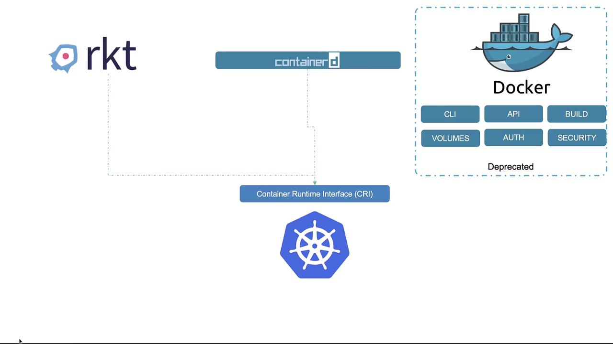

# Docker Deprecation

Originally, Docker was the sole supported container runtime for Kubernetes. To enable compatibility with other container runtimes, the Container Runtime Interface (CRI) was introduced. Docker, as a complete platform, bundled several tools together, including:

- The Docker CLI
- The API
- Build tools for creating images
- Volume support
- Security configurations
- The container runtime (runc)
- The daemon (containerd) that managed the runtime

Containerd is now CRI-compatible and functions as a standalone component that interacts directly with Kubernetes. Kubernetes no longer depends on Docker’s additional tools since it manages container operations natively.

 

While Kubernetes has officially deprecated Docker as its runtime, Docker remains the most popular container solution for day-to-day development and build processes. Kubernetes simply leverages containerd for orchestration but many development practices still benefit from Docker’s extensive toolset.

Even though Kubernetes doesn’t require Docker for container orchestration, using Docker to understand container fundamentals remains beneficial. Once these basics are mastered, shifting focus to Kubernetes and containerd becomes more intuitive.
