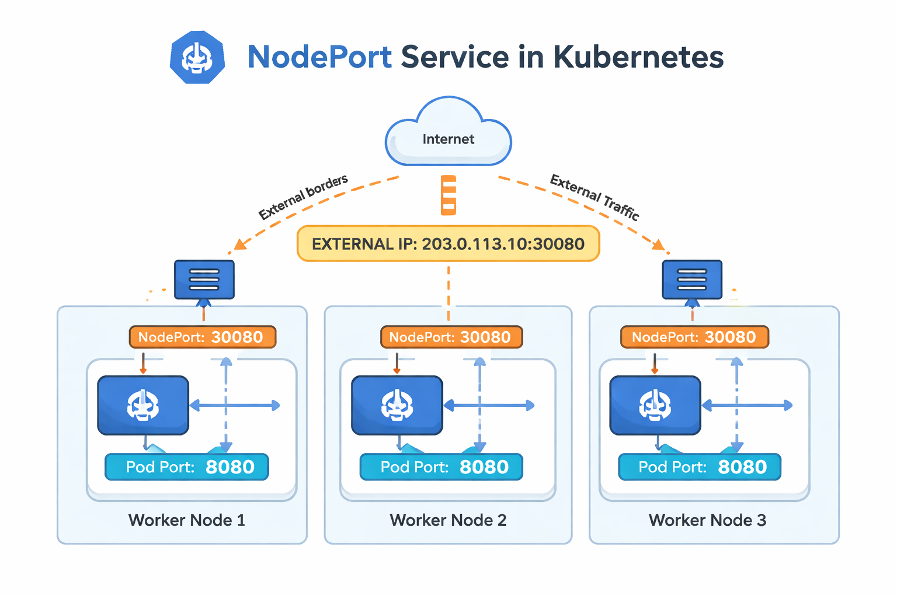

# Services

Kubernetes services enable seamless communication between various application components—both within the cluster and from the outside world.

Kubernetes services allow different sets of Pods to interact with each other. Whether connecting the front end to back-end processes or integrating external data sources, services help to decouple microservices while maintaining reliable communication. For instance, you can expose your front-end to end users and enable back-end components to interact efficiently.

### Use Case: From Internal Networking to External Access

So far, we’ve seen how Pods communicate internally using the Kubernetes network. Consider a scenario where you deploy a Pod running a web application and want an external user to access it. Here’s a quick overview of the setup:

- Kubernetes Node IP: 192.168.1.2
- Laptop IP (same network): 192.168.1.10
- Internal Pod Network: 10.244.0.0
- Pod IP: 10.244.0.2

Since the Pod is on an isolated internal network, direct access to `10.244.0.2` from your laptop isn’t possible. One workaround is to SSH into the Kubernetes node (`192.168.1.2`) and use `curl` to reach the Pod:
```
curl http://10.244.0.2
Hello World!
```
While this method works from the node, the goal is to have external access directly from your laptop using the node’s IP. This is where a Kubernetes service, specifically a NodePort service, becomes essential. A NodePort service maps requests arriving at a designated node port (like 30008) to the Pod’s target port.

For example:
```
curl http://192.168.1.2:30008
Hello World!
```
This configuration externally exposes the web server running inside the Pod.

## Types of Kubernetes Services

Kubernetes supports several service types, each serving a unique purpose:

- NodePort: Maps a port on the node to a port on a Pod.
- ClusterIP: Creates a virtual IP for internal communication between services (e.g., connecting front-end to back-end servers).
- LoadBalancer: Provisions an external load balancer (supported in cloud environments) to distribute traffic across multiple Pods.

`Remember the NodePort service type maps a specific node port (e.g., 30008) to the target port on your Pod (e.g., 80). This provides external access while keeping internal port targeting intact.`

## NodePort Service
With a NodePort service, there are three key ports to consider:

- Target Port: The port on the Pod where the application listens (e.g., 80).
- Port: The virtual port on the service within the cluster.
- NodePort: The external port on the Kubernetes node (by default in the range 30000–32767).

#### Creating a NodePort Service

Below is an example YAML file that defines a NodePort service:
```
apiVersion: v1
kind: Service
metadata:
  name: myapp-service
spec:
  type: NodePort
  ports:
    - targetPort: 80  # Port on which app is accessible
      port: 80        # Service object port
      nodePort: 30008 
  selector:
    app: myapp
    type: front-end
```

Note that if you omit `targetPort`, it defaults to the same value as `port`. Similarly, **if nodePort isn’t provided, Kubernetes automatically assigns one**.

However, this YAML definition does not link the service to any Pods. To connect the service to specific Pods, a `selector` is used, just as in ReplicaSets or Deployments. 

Consider the following Pod definition:
```
apiVersion: v1
kind: Pod
metadata:
  name: myapp-pod
  labels:
    app: myapp
    type: front-end
spec:
  containers:
    - name: nginx-container
      image: nginx
```

Save the file as service-definition.yml and create the service using:
```
kubectl create -f service-definition.yml
```
Verify the service details with:
```
kubectl get services

NAME             TYPE        CLUSTER-IP       EXTERNAL-IP   PORT(S)         AGE
kubernetes       ClusterIP   10.96.0.1        <none>        443/TCP         16d
myapp-service    NodePort    10.106.127.123   <none>        80:30008/TCP    5m
```
Access the web service externally by pointing your browser or using curl with the node IP and NodePort:
```
curl http://192.168.1.2:30008
```

## Kubernetes Services in Production

In a production environment, your application is likely spread across multiple Pods for high availability and load balancing. When Pods share matching labels, the service automatically detects and routes traffic to all endpoints. Kubernetes employs a round-robin (or random) algorithm to distribute incoming requests, serving as an integrated load balancer.

Furthermore, even if your Pods are spread across multiple nodes, Kubernetes ensures that the target port is mapped on all nodes. This means you can access your web application using the IP of any node along with the designated NodePort, providing reliable external connectivity.



`Regardless of whether your application runs on a single Pod on one node, multiple Pods on a single node, or Pods spread across several nodes, the service creation process remains consistent. Kubernetes automatically updates the service endpoints when Pods are added or removed, ensuring a flexible and scalable infrastructure.`

