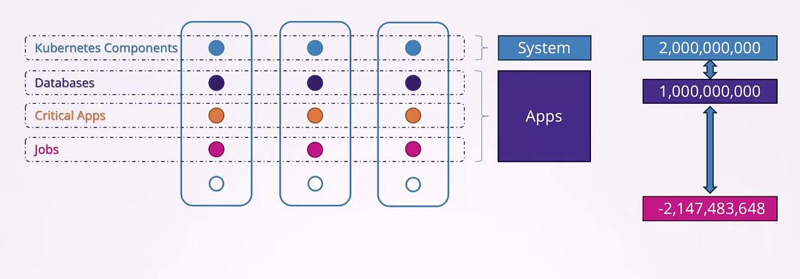

# Priority Classes

Kubernetes runs various applications as Pods with different levels of importance. For instance, control plane components run within the cluster as Pods and are vital for its operation. Similarly, production databases and critical applications are high-priority while background jobs generally have lower priority. To ensure that more important workloads are scheduled before less critical ones, Kubernetes uses priority classes.

Priority classes allow you to assign a numerical value to Pods, where a higher number indicates higher priority. For user-deployed applications, the value can range from approximately **-2 billion to +1 billion**. Additionally, there is a **reserved range for internal system-critical Pods (like the Kubernetes control plane)** which can have values **up to 2 billion**.



To check the current priority classes in your cluster, run the following command:

```
kubectl get priorityclass
```
The output may appear as follows:
```
NAME                      VALUE          GLOBAL-DEFAULT   AGE     PREEMPTIONPOLICY
system-cluster-critical   2000000000     false            7m33s   PreemptLowerPriority
system-node-critical      2000010000     false            7m33s   PreemptLowerPriority
```

### Creating a New Priority Class

To create a new priority class, define an object with the API version `scheduling.k8s.io/v1`, set the kind to `PriorityClass`, and include metadata with a name, numerical value, and an optional description. For example:

```
apiVersion: scheduling.k8s.io/v1
kind: PriorityClass
metadata:
  name: high-priority
value: 1000000000
description: "Priority class for mission critical pods"
```

After creating the priority class, you can assign it to a Pod by specifying the `priorityClassName` field in your Pod's specification. If you do not specify a priority class, the Pod is assigned a **default priority value of zero**. To change the default priority for Pods, create a priority class with the `globalDefault` property set to `true`. **Note that only one priority class can be marked as the global default**.

Below is an example that demonstrates both the creation of a priority class and how to use it in a Pod definition:

```
# priority-class.yaml
apiVersion: scheduling.k8s.io/v1
kind: PriorityClass
metadata:
  name: high-priority
value: 1000000000
description: "Priority class for mission critical pods"
globalDefault: true


# pod-definition.yaml
apiVersion: v1
kind: Pod
metadata:
  name: nginx
  labels:
    app: nginx
spec:
  containers:
    - name: nginx
      image: nginx
      ports:
        - containerPort: 8080
  priorityClassName: high-priority
```

### Pod Priority and Preemption

Consider a scenario where there are two workloads waiting to be scheduled: a critical application with a priority of 7 and a job with a priority of 5. With available resources, the higher priority critical application is scheduled first. If resources remain, the lower priority job is also scheduled.

Now, suppose a new job with a priority of 6 is submitted when no extra resources are available. Whether this new Pod preempts (or evicts) an existing lower priority Pod depends on the preemption policy defined in its priority class. By default, Kubernetes applies the `PreemptLowerPriority` policy, meaning the **scheduler will evict lower priority Pods to free up resources for higher priority ones**.

The following YAML snippet demonstrates setting the preemption policy to `PreemptLowerPriority`:

```
apiVersion: scheduling.k8s.io/v1
kind: PriorityClass
metadata:
  name: high-priority
value: 1000000000
description: "Priority class for mission critical pods"
preemptionPolicy: PreemptLowerPriority
```

If you prefer that a higher priority Pod waits for resources rather than preempting lower priority Pods, set the `preemptionPolicy` to `Never`. This change ensures the Pod remains in the scheduling queue without evicting any existing Pods:

```
apiVersion: scheduling.k8s.io/v1
kind: PriorityClass
metadata:
  name: high-priority
value: 1000000000
description: "Priority class for mission critical pods"
preemptionPolicy: Never
```

