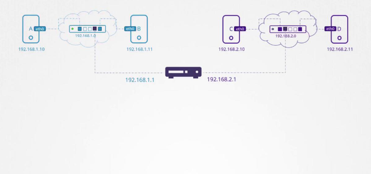

## Basic Networking Concepts

We explore essential networking concepts from a Linux perspective that are fundamental for configuring Kubernetes environments, topics such as switching, routing, gateways, DNS, network namespaces, and Docker networking. 

### Network Interfaces and Switching

Consider two systems—labeled A and B that could be laptops, desktops, or virtual machines. To enable communication between them, each system must be connected to a switch with its respective network interface (either physical or virtual). To list available interfaces on a Linux host, execute:

```bash
ip link
```

A sample output might be:

```bash
eth0: <BROADCAST,MULTICAST,UP,LOWER_UP> mtu 1500 qdisc fq_codel state UP mode DEFAULT group default qlen 1000
```

Assuming these systems belong to the network 192.168.1.0, you can assign IP addresses using the following command:

```bash
ip addr add 192.168.1.10/24 dev eth0
```

After configuration, test connectivity by pinging another host within the same network:

```bash
ping 192.168.1.11
```

A successful ping might look like:

```bash
Reply from 192.168.1.11: bytes=32 time=4ms TTL=117
```

### Routing Between Subnets

Now, consider a second network, such as 192.168.2.0, with hosts assigned IPs like 192.168.2.10 and 192.168.2.11. For communication between these two networks, a router is necessary.

A router interconnects two or more networks and holds an IP address in each network e.g., 192.168.1.1 for the first network and 192.168.2.1 for the second. When a system on network 192.168.1.0 (say, with IP 192.168.1.11) needs to communicate with a system on network 192.168.2.0, it forwards packets to the router.



Each system must be configured with a gateway or specific route entries to ensure that packets reach the intended destination. To view the current routing table, use:

```bash
route
```

Initially, communication will be limited to the same subnet. To route traffic destined for 192.168.2.0 via the router (with IP 192.168.1.1), add the following route:

```bash
ip route add 192.168.2.0/24 via 192.168.1.1
```

After adding the route, verifying the routing table should show an entry similar to:

```bash
route
Kernel IP routing table
Destination     Gateway         Genmask         Flags Metric Ref    Use Iface
192.168.2.0     192.168.1.1     255.255.255.0   UG    0      0        0 eth0
```

If a return route is required (for instance, for a host in network 192.168.2.0 to reach a host in 192.168.1.0), add the appropriate route on that system using its corresponding gateway (e.g., 192.168.2.1).

### Configuring Default Routes for Internet Access

To enable internet access (such as reaching external hosts like 172.217.194.0), configure the router as the default gateway. This is done by adding a default route:

```bash
ip route add default via 192.168.2.1
```

Afterward, your routing table might resemble the following:

```bash
route
Kernel IP routing table
Destination     Gateway         Genmask         Flags Metric Ref    Use Iface
192.168.1.0     192.168.2.1     255.255.255.0   UG    0      0        0 eth0
172.217.194.0   192.168.2.1     255.255.255.0   UG    0      0        0 eth0
default         192.168.2.1     0.0.0.0         UG    0      0        0 eth0
```

>  The "default" or "0.0.0.0" entry indicates that any destination not explicitly listed in the routing table will be directed through the specified gateway.

For scenarios involving multiple routers such as one handling internet traffic and another managing internal networks ensure each network has its specific routing entry along with a default route for all other traffic. For example, to route traffic to network 192.168.1.0 via an alternative gateway (192.168.2.2), use:

```bash
ip route add 192.168.1.0/24 via 192.168.2.2
```

The updated routing table should include:

```bash
route
Kernel IP routing table
Destination     Gateway         Genmask         Flags Metric Ref    Use Iface
default         192.168.2.1     0.0.0.0         UG    0      0        0 eth0
192.168.1.0     192.168.2.2     255.255.255.0   UG    0      0        0 eth0
```

If you encounter internet connectivity issues, reviewing the routing table and default gateway configuration is a good troubleshooting practice.

## Configuring a Linux Host as a Router

Consider a scenario with three hosts (A, B, and C) where host B connects to two subnets (192.168.1.x and 192.168.2.x) using two interfaces. For example:

* **Host A:** 192.168.1.5
* **Host B:** 192.168.1.6 and 192.168.2.6
* **Host C:** 192.168.2.5

For host A to communicate with host C, host A must direct traffic aimed at network 192.168.2.0 to host B. On host A, execute:

```bash
ip route add 192.168.2.0/24 via 192.168.1.6
```

Similarly, host C needs a route for the 192.168.1.0 network via host B (using 192.168.2.6 as the gateway):

```bash
ip route add 192.168.1.0/24 via 192.168.2.6
```

Once these routes are established, the "network unreachable" error should no longer occur when pinging between host A and host C.

### Enabling IP Forwarding on Linux

Even with the correct routing table, Linux does not forward packets between interfaces by default, as a security measure. This setting is controlled by the IP forwarding parameter in `/proc/sys/net/ipv4/ip_forward`.

To check the IP forwarding status, run:

```bash  theme={null}
cat /proc/sys/net/ipv4/ip_forward
```

A return value of `0` indicates that packet forwarding is disabled. To enable forwarding temporarily, run:

```bash  theme={null}
echo 1 > /proc/sys/net/ipv4/ip_forward
```

Verifying again should now show:

```bash  theme={null}
cat /proc/sys/net/ipv4/ip_forward
```

with the output:

```bash  theme={null}
1
```

To ensure this setting persists across reboots, modify `/etc/sysctl.conf` and add or update the following line:

```text  theme={null}
net.ipv4.ip_forward = 1
```
>  Modifying `/etc/sysctl.conf` ensures that IP forwarding remains enabled even after a system restart.

## Summary of Key Commands

Below is a summary table of essential commands covered in this article:

| Operation                        | Command Example                               |
| -------------------------------- | --------------------------------------------- |
| List network interfaces          | `ip link`                                     |
| View assigned IP addresses       | `ip addr`                                     |
| Assign an IP address             | `ip addr add 192.168.1.10/24 dev eth0`        |
| View the routing table           | `route`                                       |
| Add a specific route             | `ip route add 192.168.1.0/24 via 192.168.2.1` |
| Set a default gateway            | `ip route add default via 192.168.2.1`        |
| Check IP forwarding status       | `cat /proc/sys/net/ipv4/ip_forward`           |
| Enable IP forwarding temporarily | `echo 1 > /proc/sys/net/ipv4/ip_forward`      |

Remember, changes made with these commands are temporary and will be reset upon reboot unless they are saved in the appropriate configuration files.

# Prerequisite DNS

Learn how local name resolution works and how to transition from simple `/etc/hosts` setups to a full-blown centralized DNS server.

## Understanding Local Name Resolution

Imagine you have two computers on the same network Computer A with IP address 192.168.1.10 and Computer B with IP address 192.168.1.11. You can easily ping Computer B from Computer A using its IP address:

```bash
ping 192.168.1.11
Reply from 192.168.1.11: bytes=32 time=4ms TTL=117
Reply from 192.168.1.11: bytes=32 time=4ms TTL=117
```

Suppose Computer B offers database services. Instead of remembering its IP address, you'll refer to it by a name, for example "db". However, if you immediately try to ping "db" from Computer A, the name remains unrecognized:

```bash
ping db
ping: unknown host db
```

To make "db" recognizable, add an entry in the `/etc/hosts` file on Computer A. This informs the system that Computer B (192.168.1.11) is known as "db":

```bash
cat >> /etc/hosts
192.168.1.11    db
```

After this change, pings to "db" resolve correctly:

```bash
ping db
PING db (192.168.1.11) 56(84) bytes of data.
64 bytes from db (192.168.1.11): icmp_seq=1 ttl=64 time=0.052 ms
64 bytes from db (192.168.1.11): icmp_seq=2 ttl=64 time=0.079 ms
```

>  Once you trust the mappings in `/etc/hosts`, the system does not verify whether the actual hostname (e.g., Computer B's real name) matches the alias you defined.

You can even create multiple aliases for a single IP address. For instance, you might convince Computer A that Computer B is also known as "[www.google.com](http://www.google.com)":

```bash
cat >> /etc/hosts
192.168.1.11    db
192.168.1.11    www.google.com

ping db
PING db (192.168.1.11) 56(84) bytes of data.
64 bytes from db (192.168.1.11): icmp_seq=1 ttl=64 time=0.052 ms
64 bytes from db (192.168.1.11): icmp_seq=2 ttl=64 time=0.079 ms

ping www.google.com
PING www.google.com (192.168.1.11) 56(84) bytes of data.
64 bytes from www.google.com (192.168.1.11): icmp_seq=1 ttl=64 time=0.052 ms
64 bytes from www.google.com (192.168.1.11): icmp_seq=2 ttl=64 time=0.079 ms
```

Every time you reference a host by name whether by ping, SSH, or curl—the system consults the `/etc/hosts` file for IP address mapping. This process is called name resolution:

```bash
cat >> /etc/hosts
192.168.1.11    db
192.168.1.11    www.google.com

ping db
ssh db
curl http://www.google.com
```

>  While managing local `/etc/hosts` files works for small networks, it becomes difficult to maintain as the number of systems grows and IP addresses change.

## Scaling with a Centralized DNS Server

To overcome the challenges of managing numerous local host mappings, organizations consolidate all mappings on a centralized DNS server. Suppose your centralized DNS server is at IP address 192.168.1.100. You configure each host to use this server by editing the `/etc/resolv.conf` file:

```bash  
cat /etc/resolv.conf
nameserver 192.168.1.100
```

Once configured, any hostname that is not found in `/etc/hosts` is resolved via the DNS server. If an IP address changes, you update the DNS server's records instead of modifying each system individually. Although local `/etc/hosts` entries which are useful for test servers are still honored, they take precedence over DNS queries. The resolution order is defined in `/etc/nsswitch.conf`:

```bash
cat /etc/nsswitch.conf
...
hosts:          files dns
...
```

In this configuration, the system first searches the `/etc/hosts` file for a hostname. If a match is not found, it then queries the DNS server.

Now, if you try pinging a hostname not found in either `/etc/hosts` or the DNS server (e.g., [www.facebook.com](http://www.facebook.com)), the resolution fails:

```bash
cat >> /etc/hosts
192.168.1.115 test

cat /etc/nsswitch.conf
...
hosts:          files dns
...

ping www.facebook.com
ping: www.facebook.com: Temporary failure in name resolution
```

To resolve external domains like Facebook, add a public DNS server (for example, Google's 8.8.8.8) or configure your internal DNS server to forward unresolved queries to a public DNS resolver.

## Domain Names and Structure

Up until now, we have been resolving internal hostnames such as web, db, and nfs. But what is a domain name? A domain name (like [www.facebook.com](http://www.facebook.com)) is composed of parts separated by dots:

• The top-level domain (TLD) appears at the end (e.g., .com, .net, .edu, .org).
• The domain name precedes the TLD (e.g., facebook in [www.facebook.com](http://www.facebook.com)).
• Any segment before the domain name is considered a subdomain (e.g., www).

For instance, consider Google's domain:
• The root is implicit.
• ".com" is the TLD.
• "google" is the main domain.
• "www" is a subdomain.

Subdomains allow organizations to separate services. Examples from Google include [maps.google.com](https://maps.google.com) for maps, [drive.google.com](https://drive.google.com) for storage, and [mail.google.com](https://mail.google.com) for email.

When your organization attempts to access a domain like apps.google.com, the internal DNS server first tries to resolve the name. Failing that, it forwards the request through a hierarchical process: a root DNS server directs it to a .com DNS server, which then points to Google's DNS server. The IP address is returned and cached temporarily to expedite future queries.

Similarly, organizations like mycompany.com can structure their domain by using subdomains for different services:

* www.mycompany.com: External website
* mail.mycompany.com: Email service
* drive.mycompany.com: Storage solution
* payroll.mycompany.com: Payroll systems
* hr.mycompany.com: Human resources

## Using Search Domains for Short Names

Within many organizations, it is often convenient to use short hostnames. To resolve a short name (for example, "web") to its fully qualified domain name (FQDN, such as web.mycompany.com), add a search domain to your `/etc/resolv.conf` file:

```bash  
cat >> /etc/resolv.conf
nameserver 192.168.1.100
search mycompany.com

ping web
PING web (192.168.1.10) 56(84) bytes of data.
64 bytes from web (192.168.1.10): icmp_seq=1 ttl=64 time=0.052 ms
64 bytes from web (192.168.1.10): icmp_seq=2 ttl=64 time=0.079 ms
```

Without the proper search domain, attempts to resolve "web" may fail:

```bash  
ping web
ping: web: Temporary failure in name resolution

ping web.mycompany.com
PING web.mycompany.com (192.168.1.10) 56(84) bytes of data.
64 bytes from web.mycompany.com (192.168.1.10): ttl=64 time=0.052 ms
```

You can also specify multiple search domains. In the following example, the system will sequentially append each provided domain until a match is found:

```bash
cat >> /etc/resolv.conf
nameserver 192.168.1.100
search mycompany.com prod.mycompany.com

ping web
PING web.mycompany.com (192.168.1.10) 56(84) bytes of data.
64 bytes from web.mycompany.com (192.168.1.10): icmp_seq=1 ttl=64 time=0.052 ms
64 bytes from web.mycompany.com (192.168.1.10): icmp_seq=2 ttl=64 time=0.079 ms

ping web.mycompany.com
PING web.mycompany.com (192.168.1.10) 56(84) bytes of data.
64 bytes from web.mycompany.com (192.168.1.10): ttl=64 time=0.052 ms

ping web.mvcompany.com
ping: web: Temporary failure in name resolution
```

## Overview of Common DNS Record Types

DNS records map hostnames to IP addresses and serve various other purposes. Here is an overview of some common DNS record types:

| Record Type | Hostname        | Address/Mapping                                                                         |
| ----------- | --------------- | --------------------------------------------------------------------------------------- |
| A           | web-server      | Maps hostname to an IPv4 address (e.g., 192.168.1.1)                                    |
| AAAA        | web-server      | Maps hostname to an IPv6 address (e.g., 2001:0db8:85a3:0000:0000:8a2e:0370:7334)        |
| CNAME       | food.web-server | Aliases one hostname to another (e.g., aliasing to eat.web-server or hungry.web-server) |

A records handle IPv4 addresses, AAAA records are for IPv6, and CNAME records allow hostname aliasing.

## Testing DNS Resolution Tools

While ping is the most common tool for verifying basic DNS resolution, utilities like `nslookup` and `dig` provide more detailed insights.

• The `nslookup` command does not consider `/etc/hosts` entries and only queries the configured DNS server.
• The `dig` command offers comprehensive details about DNS queries.


### Example: nslookup

```plaintext  
> nslookup www.google.com
Server:		8.8.8.8
Address:	8.8.8.8#53

Non-authoritative answer:
Name:   www.google.com
Address: 172.217.0.132
```

### Example: dig

```bash  
dig www.google.com
; <<>> DiG 9.10.3-P4-Ubuntu <<>> www.google.com
;; global options: +cmd
;; Got answer:
;; ->>HEADER<<- opcode: QUERY, status: NOERROR, id: 28065
;; flags: qr rd ra; QUERY: 1, ANSWER: 6, AUTHORITY: 0, ADDITIONAL: 1

;; OPT PSEUDOSECTION:
; EDNS: version: 0, flags:; udp: 512
;; QUESTION SECTION:
;www.google.com.            IN      A

;; ANSWER SECTION:
www.google.com.     245     IN      A       64.233.177.103
www.google.com.     245     IN      A       64.233.177.105
www.google.com.     245     IN      A       64.233.177.147
www.google.com.     245     IN      A       64.233.177.106
www.google.com.     245     IN      A       64.233.177.104
www.google.com.     245     IN      A       64.233.177.99

;; Query time: 5 msec
;; SERVER: 8.8.8.8#53(8.8.8.8)
;; WHEN: Sun Mar 24 04:34:33 UTC 2019
;; MSG SIZE  rcvd: 139
```

# Prerequisite Network Namespaces

Imagine your host as a house and namespaces as the individual rooms. Each room isolates its occupant (the container), ensuring that processes and network interfaces remain private. While the container only sees the processes within its own namespace, the host maintains oversight over all namespaces and can bridge communication between them when required.

When a container is created, it is placed in its own network namespace. Inside this namespace, the container only sees its own processes. For example, inside a container, running:

```plaintext  theme={null}
ps aux
USER     PID %CPU %MEM    VSZ   RSS TTY      STAT START   TIME COMMAND
root       1  0.0  0.0   4528   828 ?        Ss   03:06   0:00 nginx
```

However, listing processes on the host as root shows all processes running on the system—including those inside containers:

```plaintext  theme={null}
ps aux
```

```plaintext  theme={null}
(On the container)
USER       PID  %CPU %MEM    VSZ   RSS TTY      STAT START   TIME COMMAND
root         1  0.0  0.0   4528   828 ?        Ss   03:06   0:00 nginx

(On the host)
USER       PID  %CPU %MEM    VSZ   RSS TTY      STAT START   TIME COMMAND
project   3720  0.1  0.1   95500  4916 ?        R    06:06   0:00 sshd: project@pts/0
project   3725  0.0  0.1   95196  4132 ?        S    06:06   0:00 sshd: project@notty
project   3727  0.2  0.1   21352  5340 pts/0    S    06:06   0:00 -bash
root      3802  0.0  0.0   8924  3616 ?        S    06:06   0:00 docker-containerd-shim -namespace m
root      3816  1.0  0.0   4528   828 ?        Ss   06:06   0:00 nginx
```

Notice that identical processes appear with different process IDs inside the container compared to the host. This behavior highlights how namespaces isolate container processes from the host's process space.

## Network Isolation

On the networking front, the host maintains its own interfaces, ARP tables, and routing configurations—all of which remain hidden from containers. When a container is created, a dedicated network namespace gives it its own virtual interfaces, routing table, and ARP cache.

For example, running the following command on your host:

```bash  theme={null}
ip link
```

displays the host’s interfaces (such as the loopback and Ethernet interfaces). To examine interfaces within a specific network namespace (for example, the "red" namespace), use:

```bash  theme={null}
ip netns exec red ip link
```

Or with the shorthand using the –n option:

```bash  theme={null}
ip -n red link
```

Inside the namespace, you typically see only a loopback interface, ensuring that host-specific interfaces (e.g., `eth0`) remain hidden. This isolation applies similarly to ARP and routing tables.

## Connecting Network Namespaces

By default, a network namespace has no connectivity because it lacks defined interfaces or routes. To connect namespaces, you create virtual Ethernet (veth) pairs that act like cables between two entities.

For example, to connect two namespaces—named "red" and "blue"—first create a veth pair:

```bash  theme={null}
ip link add veth-red type veth peer name veth-blue
```

Then, assign each end to its respective namespace:

```bash  theme={null}
ip link set veth-red netns red
ip link set veth-blue netns blue
```

Next, assign IP addresses to each namespace’s interface—for example, 192.168.15.1 for "red" and 192.168.15.2 for "blue" and bring the interfaces up:

```bash  theme={null}
ip -n red addr add 192.168.15.1/24 dev veth-red
ip -n blue addr add 192.168.15.2/24 dev veth-blue

ip -n red link set veth-red up
ip -n blue link set veth-blue up
```

Test connectivity by pinging from the red namespace to the blue namespace:

```bash  theme={null}
ip netns exec red ping 192.168.15.2
```

Verify neighbor discovery using ARP from within the red namespace:

```bash  theme={null}
ip netns exec red arp
```

Expected output:

```plaintext  theme={null}
Address          HWtype  HWaddress           Flags Mask  Iface
192.168.15.2    ether   ba:b0:6d:68:09:e9   C               veth-red
```

Similarly, checking the ARP table in the blue namespace should display an entry for the red namespace. Note that these internal veth interfaces do not appear in the host’s ARP table.

## Creating a Virtual Switch for Multiple Namespaces

When working with more than two namespaces, linking every pair using veth pairs is impractical. Instead, establish a virtual network switch (or bridge) on the host to interconnect all namespaces. Linux offers tools such as the native Linux bridge or Open vSwitch.

In this example, a Linux bridge is created:

1. Create a new bridge interface (named `v-net-0`):

   ```bash  theme={null}
   ip link add v-net-0 type bridge
   ```

2. Bring the bridge interface up:

   ```bash  theme={null}
   ip link set v-net-0 up
   ```

Namespaces can now be connected to this bridge. Remove the earlier direct veth pair as it is no longer necessary:

```bash  theme={null}
ip -n red link del veth-red
```

Next, create new veth pairs to link each namespace to the bridge. For example, create a pair with one end named `veth-red` (to be moved into the red namespace) and the other end named `veth-red-br` (to be attached to the bridge):

```bash  theme={null}
ip link add veth-red type veth peer name veth-red-br
ip link add veth-blue type veth peer name veth-blue-br
```

Attach the veth interfaces to their corresponding namespaces and the bridge:

```bash  theme={null}
ip link set veth-red netns red
ip link set veth-red-br master v-net-0

ip link set veth-blue netns blue
ip link set veth-blue-br master v-net-0
```

Assign IP addresses and activate the interfaces inside each namespace:

```bash  theme={null}
ip -n red addr add 192.168.15.1/24 dev veth-red
ip -n blue addr add 192.168.15.2/24 dev veth-blue

ip -n red link set veth-red up
ip -n blue link set veth-blue up
```

To allow the host to communicate with the namespaces, assign an IP from the same subnet to the bridge interface:

```bash  theme={null}
ip addr add 192.168.15.5/24 dev v-net-0
```

You can now verify connectivity from the host, for example:

```bash  theme={null}
ping 192.168.15.1
```

All traffic within this network remains private to the host, ensuring that namespaces are not directly accessible from external networks.

## Enabling External Connectivity

The internal network created by namespaces and a bridge is isolated from external networks. Suppose your host’s external interface utilizes a LAN subnet (e.g., 192.168.1.0/24) and you wish for namespaces to communicate with external systems. For instance, pinging an external host (192.168.1.3) from the blue namespace would initially result in a "Network is unreachable" error:

```bash  theme={null}
ip netns exec blue ping 192.168.1.3
```

Checking the routing table in the blue namespace using:

```bash  theme={null}
ip netns exec blue route
```

might display:

```plaintext  theme={null}
Destination     Gateway         Genmask         Flags Metric Ref    Use Iface
192.168.15.0    0.0.0.0         255.255.255.0   U     0      0        0 veth-blue
```

To enable external connectivity, add a route in the blue namespace that directs traffic destined for 192.168.1.0/24 via the host’s IP on the bridge (192.168.15.5):

```bash  theme={null}
ip netns exec blue ip route add 192.168.1.0/24 via 192.168.15.5
```

After this route is added, the blue namespace can reach external networks. However, external networks will not recognize the private IP addresses. To address this, configure NAT on the host using iptables. This setup masquerades packets from the 192.168.15.0/24 network with the host's external IP, making the traffic routable on the LAN.

To provide namespaces with Internet access (such as pinging 8.8.8.8), add a default route in the namespace pointing to the host; the host must then perform NAT to forward the traffic correctly.

## Enabling Inbound Access

Thus far, namespaces are isolated on an internal network and are not directly accessible from external hosts. For instance, if the blue namespace runs a web application on port 80, external users cannot access it simply by targeting its private IP.

There are two common solutions:

1. Add a static route on the external router or host so that traffic for the 192.168.15.0/24 network is directed through the host’s LAN IP (e.g., 192.168.1.2).

2. Use port forwarding via iptables on the host to redirect traffic arriving at a specific port (e.g., port 80) to the corresponding port in the namespace.

>  The port forwarding method is often preferred, as it eliminates the need to reconfigure external routing.

# Prerequisite Docker Networking

We explore the various networking options available in Docker and how they relate to network namespaces. We'll begin by focusing on a single Docker host a server with Docker installed. Assume the host has an Ethernet interface (eth0) with the IP address 192.168.1.10 on the local network.

## Docker Networking Modes

When you run a container, Docker provides several networking modes to tailor connectivity to your application's needs:

### None Network

With the "none" network mode, the container is not attached to any network. As a result, it cannot communicate with external systems, nor can external systems reach the container. For example:

```bash  theme={null}
docker run --network none nginx
```

>  Multiple containers started in the none network mode remain completely isolated from each other and the external network.

### Host Network

In the host network mode, the container shares its host's network stack. This means there is no network isolation between the host and the container. For instance, if a web application inside the container listens on port 80, that application immediately becomes accessible on port 80 of the host. However, running a second container that also attempts to bind to the same port will result in a failure because two processes cannot share the same port on the host. For example:

```bash  theme={null}
docker run --network host nginx
```

### Bridge Network

The default Docker networking mode is the bridge network. When Docker is installed, it automatically creates an internal private network called "bridge" (visible as "docker0" on the host) with a default subnet (usually 172.17.0.0/16). Each container connected to this network receives a unique IP address from this subnet. For example, running two containers:

```bash  theme={null}
docker run nginx
docker run nginx
```

These containers communicate with each other over the internal bridge network. To inspect the list of available networks, use:

```bash  theme={null}
docker network ls
```

An example output might look like:

```text  theme={null}
NETWORK ID          NAME                DRIVER              SCOPE
2b6008726112        bridge              bridge              local
0beb4870b093        host                host                local
99035e02694f        none                null                local
```

Internally, Docker creates the "docker0" interface on the host, serving as the bridge between host and containers. Although the command output names it "bridge," it is implemented as the "docker0" interface. Verify this by running:

```bash  theme={null}
ip link show docker0
```

By default, the "docker0" interface is assigned the IP address 172.17.0.1. When a container is launched, Docker creates a new network namespace for it (similar to those discussed in earlier lessons). To list the available network namespaces (a minor hack may be required to display Docker-created namespaces):

```bash  theme={null}
ip netns list
```

Typically, the namespace will have a name starting with an identifier like `b3165...`. To view the network namespace details associated with a container, inspect the container details with:

```bash  theme={null}
docker inspect <container_id>
```

A snippet of the output under "NetworkSettings" might appear as follows:

```json  theme={null}
"NetworkSettings": {
    "Bridge": "",
    "SandboxID": "b3165c10a92b50edc4c8aa5f37273e180907ded31",
    "SandboxKey": "/var/run/docker/netns/b3165c10a92b"
}
```

## Container Attachment to the Bridge Network

Docker attaches each container to the bridge network by creating a pair of virtual interfaces essentially a virtual cable with an interface at each end. One interface is connected to the host's "docker0" bridge, and the other interface is placed inside the container's network namespace.

Inspect the interfaces on the Docker host using:

```bash  theme={null}
ip link show
```

You might see an output similar to:

```text  theme={null}
4: docker0: <BROADCAST,MULTICAST,UP,LOWER_UP> mtu 1500 qdisc noqueue state UP mode DEFAULT group default
    link/ether 02:42:9b:5f:d6:21 brd ff:ff:ff:ff:ff:ff
8: vethbb1c343@if7: <BROADCAST,MULTICAST,UP,LOWER_UP> mtu 1500 qdisc noqueue master docker0 state UP mode DEFAULT group default
    link/ether 9e:71:37:83:9f:50 brd ff:ff:ff:ff:ff:ff link-netnsid 1
```

To inspect the network namespace of a container (for example, with namespace ID `b3165c10a92b`), run:

```bash  theme={null}
ip -n b3165c10a92b link show
```

The output might be similar to:

```text  theme={null}
7: eth0@if8: <BROADCAST,MULTICAST,UP,LOWER_UP> mtu 1500 qdisc noqueue state UP mode DEFAULT group default
    link/ether 02:42:ac:11:00:03 brd ff:ff:ff:ff:ff:ff link-netnsid 0
```

To view the IP address assigned to the container’s network interface:

```bash  theme={null}
ip -n b3165c10a92b addr show eth0
```

This may display:

```text  theme={null}
7: eth0@if8: <BROADCAST,MULTICAST,UP,LOWER_UP> mtu 1500 qdisc noqueue state UP group default
    link/ether 02:42:ac:11:00:03 brd ff:ff:ff:ff:ff:ff link-netnsid 0
    inet 172.17.0.3/16 brd 172.17.255.255 scope global eth0
       valid_lft forever preferred_lft forever
```

Each time a new container is created, Docker follows these sequential steps:

1. Creates a new network namespace.
2. Establishes a pair of virtual interfaces.
3. Attaches one end to the container’s namespace and the other to the "docker0" bridge.
4. Assigns an IP address to the container's interface.

The virtual interface pairs are numbered consistently, with odd and even numbers forming a pair (e.g., 7 and 8, 9 and 10).

## Port Mapping

Consider a scenario where a container runs an nginx web application that listens on port 80. By default, since the container runs in a private network segment, only other containers on the same network or the host can access application endpoints. Port mapping (port publishing) in Docker enables external access by mapping a port on the host to a port on the container.

For example, to map port 8080 on the host to port 80 within the container:

```bash  theme={null}
docker run -p 8080:80 nginx
```

After setting up port mapping, you can test connectivity as follows:

* Accessing the container directly via its IP on port 80 might result in a failure:

  ```bash  theme={null}
  curl http://172.17.0.3:80
  # Output: curl: (7) Failed to connect... No route to host
  ```

* However, accessing the application using the host’s IP and port 8080 should succeed:

  ```bash  theme={null}
  curl http://192.168.1.10:8080
  # Output: Welcome to nginx!
  ```

All incoming traffic to port 8080 on the Docker host is forwarded to port 80 in the container.

### How Port Forwarding Works

Docker employs IP tables to implement port forwarding. This mechanism adds a Network Address Translation (NAT) rule to translate traffic arriving on a specific host port to the corresponding container port. For example, Docker might add a rule similar to the following:

```bash  theme={null}
iptables \
  -t nat \
  -A PREROUTING \
  -j DNAT \
  --dport 8080 \
  --to-destination 80
```

This rule directs traffic arriving at port 8080 on the host to port 80 on the container. You can review the active NAT table rules by running:

```bash  theme={null}
iptables -nvL -t nat
```

An excerpt from the output might resemble:

```text  theme={null}
Chain DOCKER (2 references)
target     prot opt source               destination
RETURN     all  --  anywhere             anywhere
DNAT       tcp  --  anywhere             anywhere     tcp dpt:8080 to:172.17.0.2:80
```

After the mapping is configured, testing access to the container using:

```bash  theme={null}
curl http://172.17.0.3:80
```

should return a response like:

```text  theme={null}
Welcome to nginx!
```

In summary, Docker networking offers multiple modes none, host, and bridge o manage connectivity for containers. The default bridge network uses a virtual switch (docker0) to connect containers via dedicated network namespaces, while port mapping enables external access by forwarding traffic from a designated host port to the container's port.

